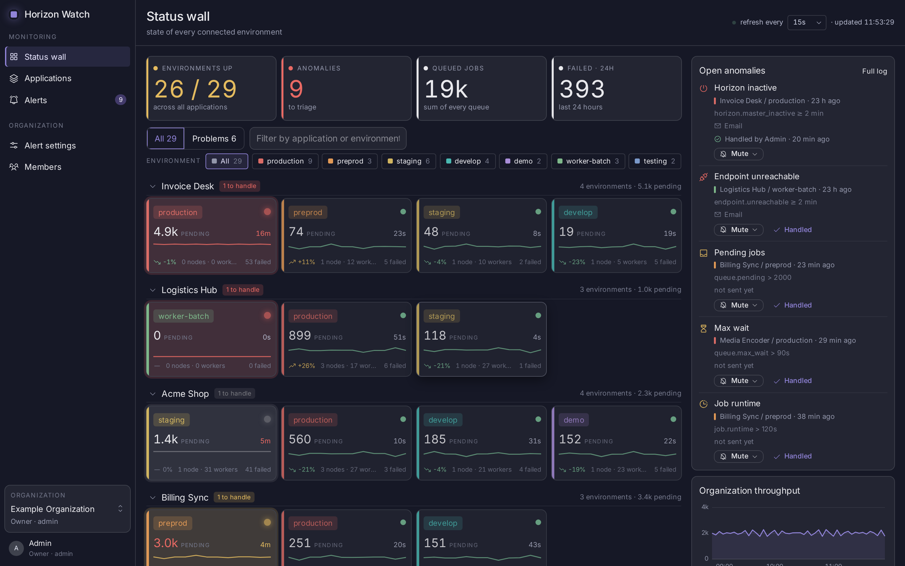
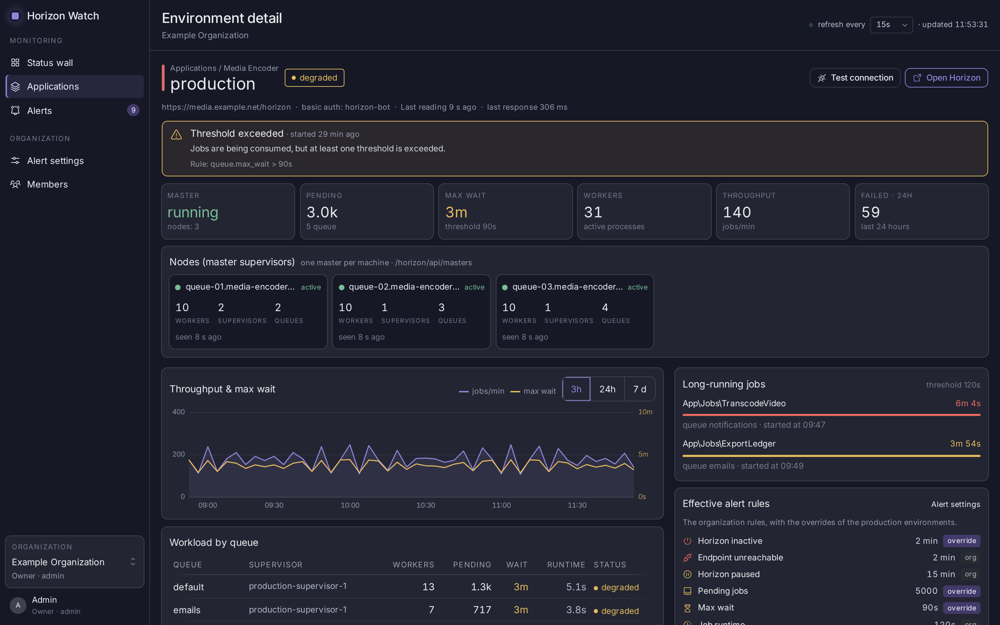
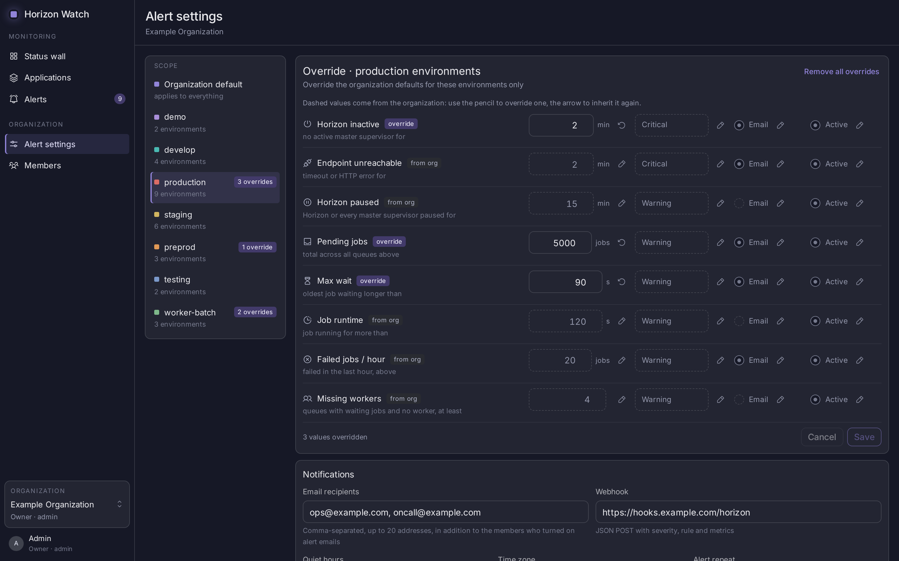

# Horizon Watch

A self-hosted control room for several Laravel Horizon installations. Horizon Watch polls the
Horizon HTTP API of every environment you register, stores the readings, evaluates your
thresholds, opens and resolves alerts, and notifies you by email and by signed webhook. One
wall shows every application and environment at a glance; one page per environment shows the
queues, the throughput and the wait times behind it.

It is not a replacement for Horizon: you keep using each application's own dashboard to
retry or delete jobs. Horizon Watch only ever reads. It never writes to Horizon, and it never
talks to your Redis — every number it shows comes from Horizon's own JSON API over HTTP.







## Requirements

- Docker with Compose v2 on the host that runs the panel.
- A PostgreSQL 18 database. `compose.prod.yaml` starts one for you; point the panel at your
  own if you prefer.
- An SMTP server, if you want invitations and alert emails to arrive. There is no fallback
  that writes emails to a log file.
- Network access from the panel to the Horizon dashboard of every monitored application.

The panel itself needs no outbound internet access: there are no CDNs, no remote fonts and no
external lookups.

## Install

Everything ships in one image, `ghcr.io/guard4534/horizon-watch`. You only need
`compose.prod.yaml`:

```bash
curl -fsSLO https://raw.githubusercontent.com/Guard4534/horizon-watch/main/compose.prod.yaml
docker compose -f compose.prod.yaml up -d
```

`compose.prod.yaml` is also attached to every release, if you would rather take it from
there.

That starts four containers: `web` (nginx and php-fpm), `scheduler`, two `worker`s and
`postgres`. Settings go in a `.env` file next to `compose.prod.yaml`, or in your shell
environment; see [Configuration](#configuration). At the very least, change `DB_PASSWORD`
and set the mail server.

Serve the panel over HTTPS in production, behind a reverse proxy that terminates TLS. Set
`APP_URL` to the `https://` address and leave `TRUSTED_PROXIES` at its default if the proxy
is on the same private network. Besides protecting the session cookie, HTTPS keeps the
one-time webhook secret out of the browser history: the page that shows it asks the browser
to encrypt its history entry, which browsers only do in a secure context.

## First run

Open the panel — `http://localhost:8080` by default. The first visit lands on `/setup` and
asks you to create the administrator and the first organization; from then on `/setup` is
closed and everyone else joins by invitation.

Then, in order:

1. **Applications** → create an application. It is a name, nothing more.
2. Add an **environment** to it: a label (`production`, `staging`, …), the URL of that
   installation's Horizon dashboard (for example `https://shop.example.com/horizon`), the
   basic-auth user and password if the dashboard is behind one, and how often to poll it
   (15 to 300 seconds). **Test connection** reads the dashboard once and tells you what it
   found before you save.
3. **Alert rules** → review the thresholds. Every organization starts with sensible defaults
   and you can override any rule for a single environment.
4. **Alert rules → Notifications** → add the email recipients, and the webhook URL if you
   want one.
5. **Members** → invite the rest of the team and pick which environments each person sees.

Readings start within a minute of saving an environment; the wall fills itself as they
arrive.

## What the monitored application needs

Horizon Watch reads `<horizon dashboard URL>/api/stats`, `/api/masters`, `/api/workload`,
`/api/jobs/failed`, `/api/jobs/pending` and the per-queue metrics. So the monitored
application needs:

- **Horizon installed and reachable over HTTP.** The default path is `/horizon`; if you moved
  it with `HORIZON_PATH`, give Horizon Watch the moved URL. Either the dashboard URL or the
  same URL ending in `/api` is accepted.
- **A way in.** Horizon's `viewHorizon` gate guards those routes outside the `local`
  environment. The simplest arrangement that does not open the dashboard to the world is to
  put HTTP basic auth in front of it at the web-server level and give Horizon Watch the
  credentials; they are stored encrypted. If you gate it in the application instead, make
  sure the gate lets a request without a session through, or Horizon Watch will only ever see
  the login redirect.

Every read is a plain `GET`; nothing Horizon Watch sends changes state. Reads follow no
redirects, time out after a few seconds, stop at 2 MB per response, ignore any proxy
configured in the environment and connect to the address the name resolved to, so a name that
changes between the safety check and the request cannot redirect the read elsewhere.

## Configuration

Everything is an environment variable, set in a `.env` file next to `compose.prod.yaml` or in
the environment of the containers. Everything has a default except the mail server.

| Variable                               | Default                                  | Purpose                                                                                  |
| -------------------------------------- | ---------------------------------------- | ---------------------------------------------------------------------------------------- |
| `HORIZON_WATCH_IMAGE`                  | `ghcr.io/guard4534/horizon-watch:latest` | Image to run; pin a version tag in production                                            |
| `HORIZON_WATCH_PORT`                   | `8080`                                   | Port published on the host                                                               |
| `HORIZON_WATCH_WORKERS`                | `2`                                      | Queue workers (readings, notifications)                                                  |
| `HORIZON_WATCH_RETENTION_DAYS`         | `30`                                     | Days of readings kept before pruning                                                     |
| `HORIZON_WATCH_ALERT_RETENTION_DAYS`   | `90`                                     | Days resolved alerts are kept before pruning                                             |
| `HORIZON_WATCH_BLOCK_PRIVATE_NETWORKS` | `false`                                  | Refuse Horizon addresses that resolve to a private network                               |
| `HORIZON_WATCH_DEFAULT_TIMEZONE`       | `UTC`                                    | Time zone new organizations start with                                                   |
| `APP_URL`                              | `http://localhost:8080`                  | Public URL, used in emails and webhook payloads                                          |
| `APP_LOCALE`                           | `en`                                     | Default language, `en` or `it`                                                           |
| `APP_KEY`                              | generated                                | Leave empty: the first start writes one to the `app-data` volume                         |
| `TRUSTED_PROXIES`                      | `private`                                | `private` (loopback and RFC 1918), `*`, or a comma-separated list of addresses and CIDRs |
| `SESSION_SECURE_COOKIE`                | `null`                                   | `null` follows the request scheme; force it with `true` or `false`                       |
| `DB_PASSWORD`                          | `horizon_watch`                          | PostgreSQL password. Change it                                                           |
| `MAIL_MAILER`                          | `smtp`                                   | Mail transport                                                                           |
| `MAIL_HOST`                            | _(empty)_                                | SMTP host. Without it every email fails                                                  |
| `MAIL_PORT`                            | `587`                                    | SMTP port                                                                                |
| `MAIL_USERNAME`                        | _(empty)_                                | SMTP user, when the server asks for one                                                  |
| `MAIL_PASSWORD`                        | _(empty)_                                | SMTP password, when the server asks for one                                              |
| `MAIL_FROM_ADDRESS`                    | `horizon-watch@example.com`              | Sender of invitations and alert emails                                                   |

`TRUSTED_PROXIES` decides which forwarded headers the panel believes. The default trusts
loopback and private addresses, which covers a reverse proxy in the same Docker network or on
the same private network, and ignores forwarded headers from anywhere else. If your proxy
reaches the panel from a public address, list it explicitly; `*` trusts everyone and should
only be used when nothing but the proxy can reach the port.

## Notifications

Critical alerts are sent as they open, repeat while they stay open (every 15, 30 or 60
minutes, your choice) and are sent again when they resolve. Warnings are collected into a
digest every 15 minutes. Each organization has its own recipients, its own quiet settings and
its own webhook.

Email goes out only through the SMTP server you configure. Until `MAIL_HOST` is set, every
email — invitations and alerts — fails: the panel lists alert emails as not delivered, and
invitations stay in the failed jobs of the queue. There is deliberately no fallback that
writes emails to the log, because the log would then hold recipients and links.

### Webhook

An organization can send its alerts to one webhook URL (Alert rules → Notifications). The
panel `POST`s JSON with these headers:

- `Content-Type: application/json`, `User-Agent: HorizonWatch`
- `X-Horizon-Watch-Timestamp`: the Unix time of the send
- `X-Horizon-Watch-Signature`: `sha256=` followed by the hex HMAC-SHA256 of
  `<timestamp>.<raw body>`, keyed with the organization's webhook secret

The secret is shown once, when the first URL is saved or when it is regenerated (serve the
panel over HTTPS, see [Install](#install)). Put any token in the URL path: query strings and
credentials in the URL are refused. The receiver has 5 seconds to answer with a 2xx;
redirects are not followed, the response body is ignored, and a failed delivery is tried
three times (after 10 and 60 seconds) before it is logged as failed.

```json
{
    "event": "alert.opened",
    "delivery_id": "0f6d2c1e-8a4b-4c3d-9e2f-1a2b3c4d5e6f",
    "alert": {
        "id": "01992f3c-5a4e-7b1d-9c2a-6d3e4f5a6b7c",
        "rule": "horizon.master_inactive",
        "severity": "critical",
        "value": 14,
        "threshold": 5,
        "unit": "min",
        "application": "Shop",
        "environment": "production",
        "opened_at": "2026-09-17T12:02:00Z",
        "resolved_at": null,
        "url": "https://horizon-watch.example.com/acme/environments/production"
    },
    "organization": { "name": "Acme", "slug": "acme" },
    "sent_at": "2026-09-17T12:02:04Z"
}
```

`event` is `alert.opened`, `alert.repeated` or `alert.resolved` (critical alerts),
`alert.digest` (warnings, every 15 minutes, with an `alerts` list instead of `alert`) or
`test` (with `"alert": null`). `url` is `null` once the environment is deleted.

`delivery_id` names one delivery and stays the same when a failed delivery is tried again,
while `sent_at` is the time of each attempt. A receiver that answered too slowly may get the
same delivery twice: deduplicate on `delivery_id`.

Verify the signature before trusting the body, and reject old timestamps:

```php
$body = file_get_contents('php://input');
$timestamp = (int) ($_SERVER['HTTP_X_HORIZON_WATCH_TIMESTAMP'] ?? 0);
$expected = 'sha256='.hash_hmac('sha256', $timestamp.'.'.$body, getenv('HORIZON_WATCH_WEBHOOK_SECRET'));

if (abs(time() - $timestamp) > 300
    || ! hash_equals($expected, $_SERVER['HTTP_X_HORIZON_WATCH_SIGNATURE'] ?? '')) {
    http_response_code(401);
    exit;
}
```

This is what `App\Externals\Webhook\Signature::sign()` computes.

## Running commands

`docker compose exec` bypasses the image's entrypoint, so the command would run as root
without an application key. Use `run` and the `artisan` role instead, which loads the key and
drops to the `www-data` user:

```bash
docker compose -f compose.prod.yaml run --rm web artisan about
docker compose -f compose.prod.yaml run --rm web artisan queue:failed
docker compose -f compose.prod.yaml run --rm web artisan schedule:list
```

## Logs

Every container logs to standard output, so `docker compose logs` is the whole story:

```bash
docker compose -f compose.prod.yaml logs -f web
docker compose -f compose.prod.yaml logs -f worker
```

`web` carries the nginx access log, the php-fpm log and the application log; `worker` carries
the queue. Nothing that could be a credential is ever logged: an unexpected failure inside
the Horizon reader is reported by class, file and line only, because its message could hold a
URL with credentials or a slice of a response body.

## Upgrading

```bash
docker compose -f compose.prod.yaml pull
docker compose -f compose.prod.yaml up -d
```

Migrations run when the `web` container starts, under an advisory lock, so several replicas
can start at once. Read [CHANGELOG.md](CHANGELOG.md) before a major version.

## Backup and restore

Two volumes hold everything:

- `postgres-data` — every application, environment, reading, rule and alert.
- `app-data` — the application key. **It decrypts the Horizon basic-auth passwords stored in
  the database.** Lose it and those passwords are unreadable; you would have to re-enter them
  on every environment.

Back up both, together:

```bash
docker run --rm -v horizon-watch_postgres-data:/from -v "$PWD":/to alpine \
    tar czf /to/postgres-data.tgz -C /from .
docker run --rm -v horizon-watch_app-data:/from -v "$PWD":/to alpine \
    tar czf /to/app-data.tgz -C /from .
```

Both volume names are prefixed with the Compose project name, which is the name of the
directory holding `compose.prod.yaml` unless you pass `-p`; `docker volume ls` shows the real
names.

Restore into a stopped stack by untarring each archive back into the matching volume. If you
would rather keep the key yourself, set `APP_KEY` in the environment: when it is set, the
entrypoint uses it and never touches `/data/app-key`.

## Troubleshooting

**Every alert email is listed as not delivered, and invitations never arrive.** `MAIL_HOST`
is empty. Set the SMTP settings and restart the stack; there is no log fallback by design.

**`/setup` keeps appearing.** No user exists yet, so every route redirects there. If you have
already created the administrator and still land on `/setup`, the panel is talking to an
empty database — check `DB_*` and that the `postgres` container is the one holding your
volume.

**The panel answers 502 and the `web` log says `upstream sent too big header`.** nginx's
FastCGI buffers are too small for the `Link` header that preloads the page's assets.
`docker/prod/nginx.conf` already raises them; if you replaced that file, raise
`fastcgi_buffer_size` and `fastcgi_buffers` again.

**The `app-data` volume is gone.** A new key is generated on the next start. Everything still
works except the stored Horizon basic-auth passwords, which can no longer be decrypted: open
each environment and enter its password again.

**A Horizon URL is refused when saved.** The panel refuses credentials and query strings in
the URL, non-HTTP schemes, and — when `HORIZON_WATCH_BLOCK_PRIVATE_NETWORKS` is `true` —
addresses that resolve to a private or link-local network. Cloud metadata addresses are
always refused.

## Development

See [CONTRIBUTING.md](CONTRIBUTING.md) for the full setup. In short:

```bash
composer install
./vendor/bin/sail up -d
./vendor/bin/sail exec pgsql createdb -U sail testing
./vendor/bin/sail composer run setup
./vendor/bin/sail composer run dev
```

`./vendor/bin/sail composer ci:check` runs everything CI runs: Pint, Larastan, the front-end
lint and type check, and the Pest suite.

`./vendor/bin/sail php artisan migrate:fresh --seed` fills the database with a demo
organization and a few weeks of readings, and creates an administrator:
`admin@example.com` / `password`. Never seed a database you care about.

## Security

Please report vulnerabilities privately; see [SECURITY.md](SECURITY.md).

## License

MIT — see [LICENSE](LICENSE).
